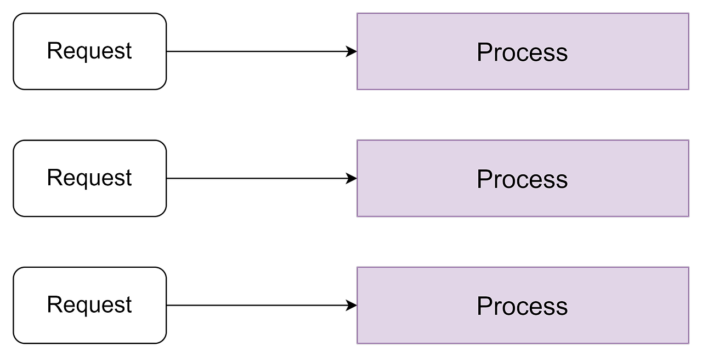
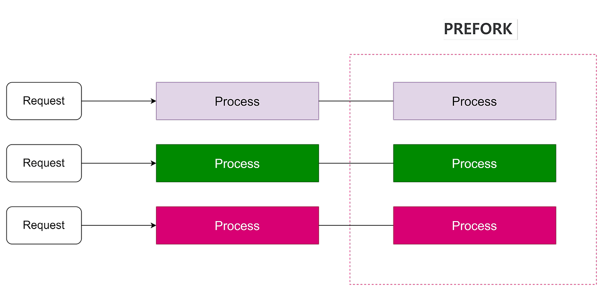
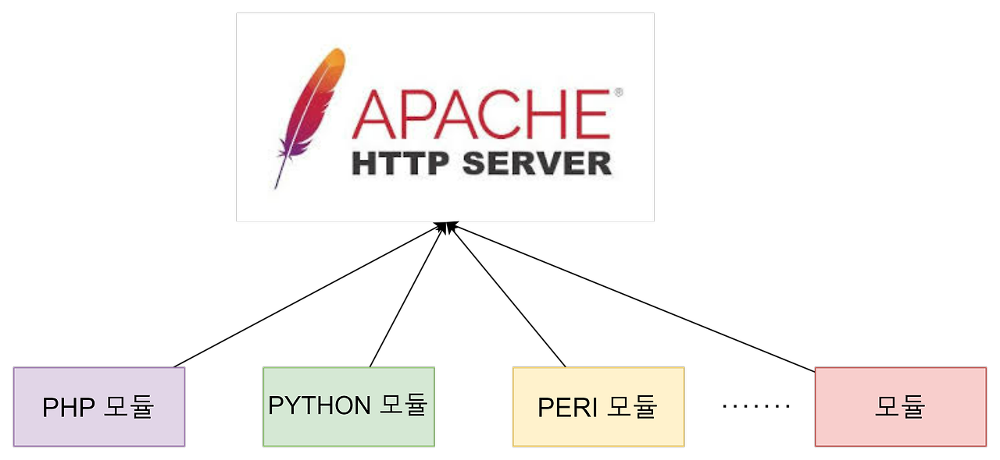
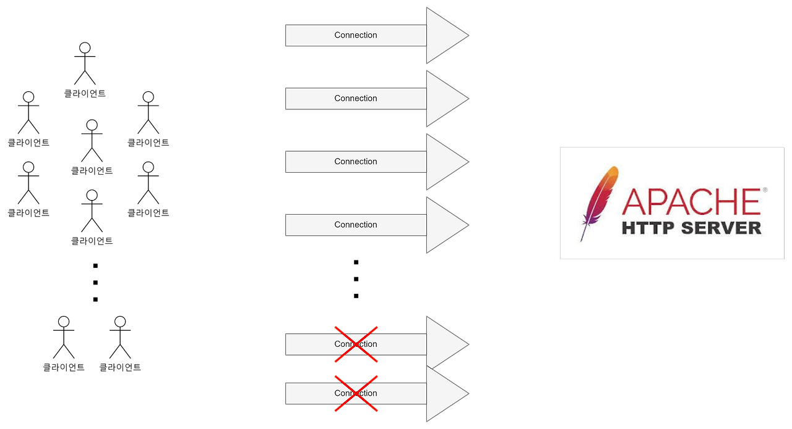
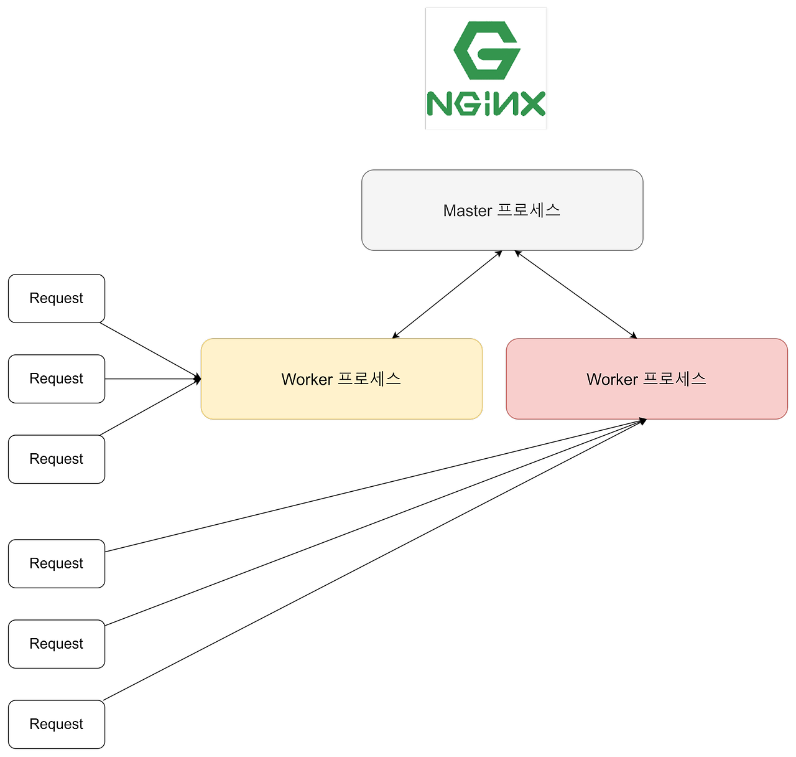
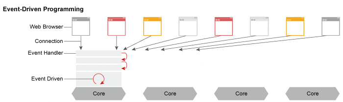
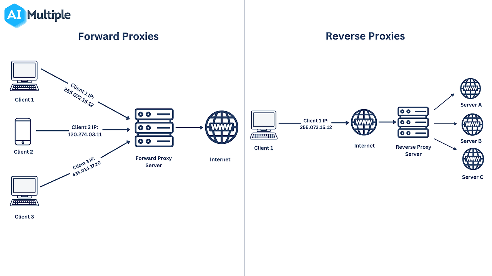

# Nginx

## 작성하게된 계기

처음부터 프로젝트를 개발하게되면서 nginx를 사용하게 되었는데

중간에 삽질도 하면서, 다음번에는 삽질을 하지말자는 계기로 이렇게 글을 작성하게된다.

## Nginx란?

NGINX는 오픈소스 소프트웨어 웹 서버로 시작되었다.

지금은 웹서버의 역할뿐만 아니라 프록시 서버, 캐싱, 분산 처리, 미디어 스트리밍등

다양한 기능을 제공한다.

기능뿐만 아니라 성능면에서 기존의 웹서버들보다 뛰어나 nginx는 가장 널리 사용되고 있는 웹 서버이다.

nginx가 등장하기 이전에 웹 서버의 대표 주자였던 Apache보다 어떤 장점이 있길래,

현재는 가장 많이 사용되는 웹서버가 되었는지 보자.
  
<br />
  
## Nginx VS Apache

### Apache의 동작 원리

Apache 이전에 웹서버로 사용하던 NCSA HTTPD가 있었지만,

버그가 많이 발생해서 사용하는데 불편한 점이 많았다.

이러한 문제점을 해결하기 위해 나온 웹서버가 Apache이다.

Apache의 동작 원리를 확인해보자.

<br />

#### 요청마다 새로운 process를 생성한다.

Apache는 각 요청마다 새로운 프로세스를 생성하여 요청을 처리한다.

요청마다 독립적인 메모리 공간을 사용하기 때문에 안정적이지만  

요청 수가 많아질수록 메모리에 부하가 발생한다.
  
  

#### PREFORK 방식

요청을 처리하기 위해, 요청마다 프로세스를 생성하면 그에 따른 비용이 발생한다.

PREFORK 방식을 사용하여 미리 프로세스를 만들어놓고

요청이 드렁오면 프로세스를 할당하는 방식으로 동작한다.

쉬고 있는 프로세스가 없을 경우에 프로세스를 새로 생성해서 요청을 처리하는 방식이다.
  
  

#### 동적 컨텐츠 (확장성)

Apache는 요청마다 독릭적인 프로세스를 처리하는 구조로 다양한 모듈을 만들어서

서버에 빠르게 기능을 추가할 수 있었다. 확장성이 높고, 동적인 컨텐츠도 처리할 수 있어서

다양한 웹 어플리케이션 환경에서 유연하게 사용할 수 있었다.



### Apache의 문제점

컴퓨터 보급이 증가함에 따라서, 서버의 연결 요청 커넥션이 급격하게 증가한다.

Apache는 프로세스 기반 구조로 인해 요청에 대한 새로운 연결을 처리하지 못하는

문제가 발생한다.




#### 메모리 부하

매 요청마다 새로운 프로세스를 생성하므로, 메모리 사용량의 증가로 인해

새로운 연결을 처리하지 못하는 문제가 발생했다.

C10K(Connection 10000 Problem)

#### 컨텍스트 스위칭으로 인한 CPU 부하

많은 프로세스가 생성되면, CPU는 각 프로세스 간의 컨텍스트 스위칭을

많이 하게 되어 CPU에 부하가 증가한다.

Apache도 이러한 문제점을 개선하기 위해 Worker MPM이란 구조를 추가했다.

Worker MPM은 프로세스 기반이 아닌, 각 프로세스 내에서 쓰레드를

사용하여 요청을 처리하는 방식이다.

하지만 각 프로세스가 다수의 쓰레드를 사용하므로, 메모리 사용량은 줄어들지만

성능 문제는 완전히 해결하지 못했다.

### Nginx 동작 원리

Apache의 구조적인 문제와 해결하기 위해 Nginx가 등장했다.

nginx는 요청에 대한 커넥션을 효율적으로 처리할 수 있는 구조로 설계되었다.

하지만 nginx는 동적인 컨텐츠를 직접 처리할 수 없다.

nginx는 클라이언트의 요청에 대한 Connection을 유지하고,

정적 컨텐츠는 직접 처리하고, 동적 컨텐츠 요청은 Apache에 전달하여 부하를 줄일 수 있다.

nginx가 어떻게 많은 Connection을 유지할 수 있는지 동작 원리를 살펴보자.

#### master-worker process

Nginx는 master-worker 프로세스 모델을 사용한다.

master 프로세스는 설정 파일을 읽고, worker 프로세스를 생성하고 관리한다.

worker 프로세스는 실제로 클라이언트 요청을 처리하는 프로세스이다.



#### event driven

nginx는 비동기 이벤트 기반 모델을 사용하며, 각 요청을 이벤트 루프를 사용해

I/O 작업을 논블로킹 방식으로 수행한다.

하나의 work 프로세스가 수 천 개의 연결을 동시에 처리할 수 있어,

CPU, 메모리 사용을 최대한 효율적으로 사용한다.



#### nginx 장단점

- 장점
    - 클라이언트의 동시 요청을 최대한 효율적으로 처리할 수 있다. -> event driven
    - 웹서버의 역할뿐만 아니라 프록시 서버, 캐싱, 분산 처리 등 다양한 기능을 제공한다.
- 단점
    - 동적 콘텐츠를 직접 처리할 수 없다.
    - 그로 인한 동적 컨텐츠를 제공하기 위해서는 외부 자원과 연동해서 사용해야한다.

### nginx 용도

#### 웹서버

정적 컨텐츠(HTML, CSS, Javascript, 이미지)를 제공할 수 있는 웹서버의 역할을 할 수 있다.

#### 프록시 서버



- Forward Proxy
    - 클라이언트 요청을 대신하여 외부 서버에 전달하고, 외부 서버의 응답을 클라이언트에게 전달하는 서버
    - 캐싱: 자주 요청되는 외부 컨텐츠를 캐싱하여, 응답 속도를 높일 수 있다.
    - 익명화: 외부 서버는 클라이언트의 IP 주소를 알 수 없으므로 익명성을 유지한다.

- Reverse Proxy
    - 클라이언트 요청을 받아 백엔드 서버로 전달하고, 백엔드 서버의 응답을 다시 클라이언트로 전달하는 서버
    - 보안: 클라이언트가 백엔드 서버로 직접 접근하지 못하게 하여, 서버를 외부로부터 보호할 수 있다.
    - 로드 밸런싱: 여러 백엔드 서버로 트래픽을 분산하여 서버 부하를 균형 있게 처리할 수 있다.
    - SSL 터미네이션: HTTPS 요청을 NGINX에서 처리하고, 백엔드로 전달할 때 http 프로토콜로 전달한다. -> SSL/TLS 처리를 nginx에서 처리하여, 백엔드에서의 복호화에 대한 부담을 줄여준다.
    - 캐싱: 자주 요청되는 컨텐츠를 캐싱하여, 백엔드의 부담을 줄여주고 응답 속도를 높인다.

### NGINX 환경 설정

nginx의 설정 파일은 기본적으로 /etc/nginx/nginx.conf 또는

/etc/nginx/conf.d/*conf, /etc/nginx/site-enables에 위치한다.

해당 경로로 이동해서 설정 파일을 용도에 맞게 작성할 수 있다.

#### 웹서버 설정 예시 파일

```nginx
server {
    # HTTP 포트
    listen 80;  

    # 서버 도메인 이름
    server_name example.com www.example.com;  

    # 웹 콘텐츠가 위치하는 루트 디렉토리
    root /var/www/html;  
    # 기본 인덱스 파일
    index index.html index.htm;  

    # 요청된 파일이 존재하지 않으면 404 반환
    location / {
        try_files $uri $uri/ =404;  
    }
}
```

#### 로드밸런싱 설정 예시

```nginx
http {
    upstream backend_servers {
        # 백엔드 서버 1
        server backend1.example.com weight=5;  
        # 백엔드 서버 2
        server backend2.example.com weight=1;  
        # 백엔드 서버 3
        server backend3.example.com weight=1;  
        # weight 파라미터는 서버 가중치를 설정합니다.
    }

    server {
        # HTTP 포트
        listen 80; 

        # 로드 밸런서의 도메인 이름
        server_name example.com;  

        # 백엔드 서버 그룹으로 요청을 전달합니다.
        location / {
            proxy_pass http://backend_servers; 
            proxy_set_header Host $host;
            proxy_set_header X-Real-IP $remote_addr;
            proxy_set_header X-Forwarded-For $proxy_add_x_forwarded_for;
            proxy_set_header X-Forwarded-Proto $scheme;
        }
    }
}
```